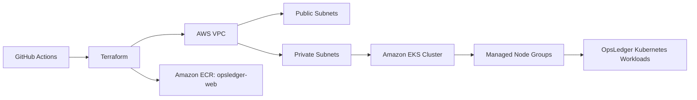

# OpsLedger Infrastructure Architecture

OpsLedger runs on Amazon EKS in `ap-southeast-3`.



## Design

The VPC module creates three public subnets and three private subnets. Kubernetes workload nodes run in private subnets, while public subnets are tagged for load balancers.

The EKS module creates the `opsledger-eks` cluster and two managed node groups using `t3.small` instances. This keeps the environment small enough for a portfolio project while still showing multi-node operational behavior. Terraform also creates the `opsledger-web` ECR repository used by the application build workflow.

## Terraform Workflow

The GitHub Actions workflow runs:

```bash
terraform init
terraform fmt -check
terraform validate
terraform plan -out=tfplan
terraform apply -auto-approve tfplan
```

The workflow is manual-only by default. Run it with `apply=false` for validation and planning, then rerun with `apply=true` when infrastructure changes should be applied.
